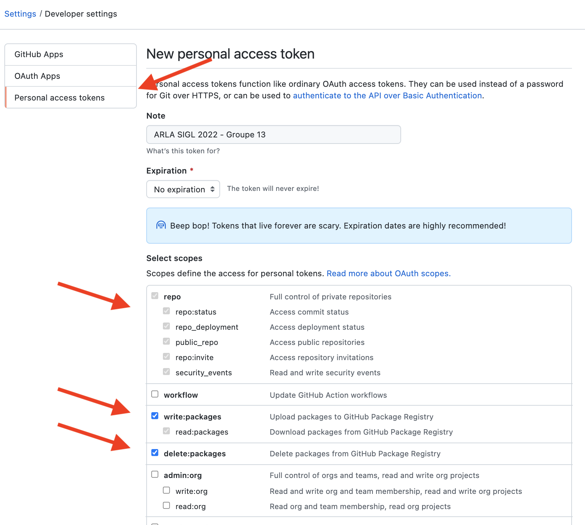
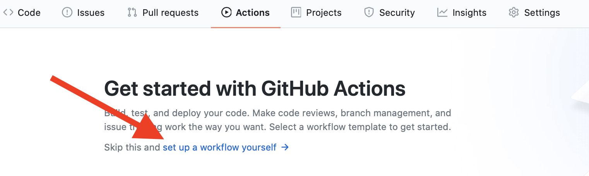
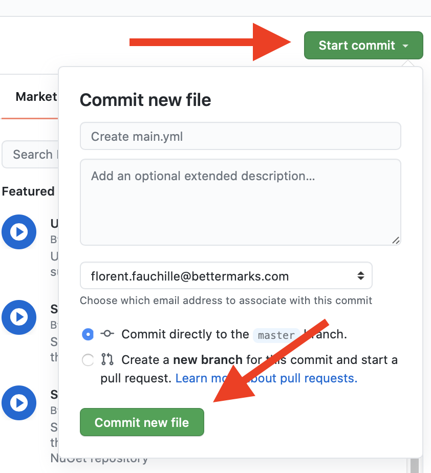
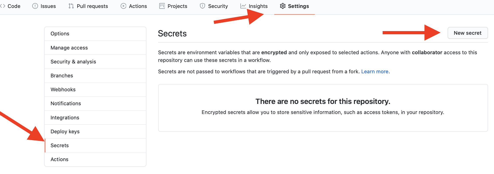
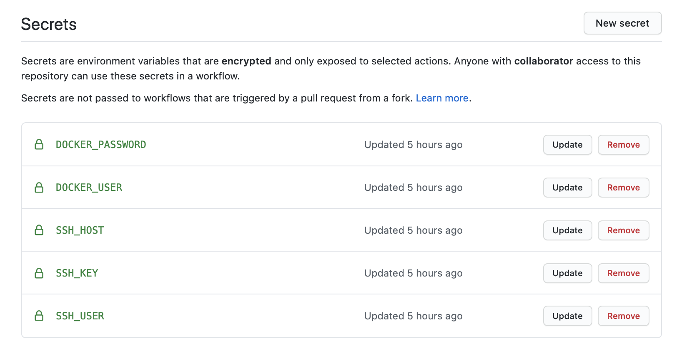

# Continuous Delivery for SIGL-2021

## Objective

- Implement continuous delivery for your project Garlaxy

## Build your continuous delivery pipeline

### Step 1: Create your git repository on github

- Create one github repository for your group, with the following format for the
  name: `arla-group-XX` (e.g. `arla-group-1`, `arla-group-10`...)
- Make it private
- Add your team members to the project: Settings > Manage Access
- Add your teachers to your project:
  - Lucas: LucasBoisserie
  - Florent: ffauchille
- Push your `index.html` file on `main` from the previous workshop 

### Step 2: Dockerize your application

- Reuse your index.html file 
- Create a Dockerfile at the root of your repository
  - As a base image, use latest stable image of nginx from docker hub: https://hub.docker.com/_/nginx
  - Copy your index.html to the location of the default index.html file of
    nginx: `/usr/share/nginx/html/index.html`
- Try to build and run your page on your local host:
  - `docker build -t arla-group-XX .`
  - `docker run -p 8080:80 arla-group-XX`
  - You should see your application running on http://localhost:8080 from your
    browser

### Step 3: Deploy your image to your virtual machine (VM)

We made some changes to your VM. We installed Traefik as a web server / reverse
proxy.
This means, you will NOT need to install any web server on your VM.

> Note: Traefik is a web server that fits perfectly with containerized applications. For
> our use case, we have already installed and configure Traefik on your VM.
> 
> Traefik inspects all running container from the same docker network for docker
> labels. Based on those labels, it will configure for you the reverse proxy to
> route traefik to your application, based on the host name of the incomming HTTP request.
> Further reading here: https://docs.traefik.io/?__hstc=265350736.b8372f9d02e9354a7959f956d9ae00cd.1600363912360.1600363912360.1600363912360.1&__hssc=265350736.1.1600363912360&__hsfp=3215949073


> Note 2: The version of Traefik installed is 1.7.
> Unfortunately, we are not using version 2 of Traefik since there is quite some
> breaking changes that we didn't yet integrated into this course.

We need an external place to store/get our images since we have to send our image
among several environment (your local machine, ubuntu-latest github VM and our
production VM).

For this, you will use the docker registry provided by Github.

Next, from your local machine, you will:
- push your docker image using github registry
- run your docker image from your production VM

#### Push your docker image using github registry

In order to use Github registry, a tool that will keep the docker images for you, you need to set your github project.

- Create a Github private access token (PAT) with read/write access on registry.
  You need to create it from your personal account (only 1 team member needs to do it).
  Keep your key somewhere safe. You won't see it again.



From your local machine, you need to first login to this registry.
```shell
docker login docker.pkg.github.com -u <GITHUB_USERNAME> -p <YOUR_GITHUB_PAT>
```
You should see `Login Succeeded`

Then you're able to push image to Github's docker registry, private to your github account.

To be able to push a docker image to a registry, you need to have the correct name format for your docker image.

This means, you will need to build your docker image with a specific tag like:
```
docker build -t <registry_name>/<github_username>/<repository_name>/<image_name>:<image_tag> .
```

- The `registry_name` needs to be `docker.pkg.github.com`
- The `github_username` needs to be the one who created the repository
- The `repository_name` will be the name of your project on github, something like `arla-group-XX`
- The `image_name` could be `Garlaxy`, since this is the name of the app, but you are free to chose any valid image name.
- The `image_tag` could be `v1` since it's  the first version of Garlaxy. Once again, you're free to use any valid image tag.

Once it is build, to publish your image, you just have to push the freshly created image using `docker push` command:
```
  docker push <registry_name>/<github_username>/<repository_name>/<image_name>:<image_tag>
```
> Note: you need to push from the same session you `docker login`.

#### Run your docker image from your production VM

From your VM (ssh):
- Login to the Github Docker registry, same way you did on your local machine
- Pull your docker image using `docker pull` command:
```shell
docker pull <registry_name>/<github_username>/<repository_name>/<image_name>:<image_tag>
```

- When running your container, you need to specify Traefik labels:
```yml
  - "traefik.enable=true"
  - "traefik.docker.network=web"
  - "traefik.frontend.rule=Host:groupeXX.arla-sigl.fr"
  - "traefik.frontend.port=80"
```
- You also need to make sure you run your container in the same `docker network` as Traefik: `web`
- And add a `name` to recognize your running container: `--name garlaxy`

So your command to run the container will look like: 
```shell
  # Don't forget to specify all other labels. Make sure you put correct values.
  docker run -d --name garlaxy --network web --label traefik.enable=true [...] <docker_image_name>
```

You should be able to see your page live once again at the address: http://groupeXX.arla-sigl.fr

If so, you've just deploy a containerized web application, congrats!

### Step 4: Automate the deployment process using Github actions

This is the fun part of the workshop, where you will automate the whole process!

What we want you to achieve: 
- on every commit to main branch, I want my application
to be deploy on the production VM. 

In other words, we want you to implement continuous delivery for Garlaxy.

What we know sofar:
- build our application using docker
- publish our application using docker and github registry
- deploy our application using docker and ssh

#### Step 4.1: Create your first Github workflow

Github action is a CD tool that is fully integrated to github.

To integrate Github Actions to your project, you just have to create a new `yml`
file in your project under `.github/workflows/` directory.

Fortunately, Github provides an easy way to create a template file to avoid any
lost of time on typos.

From your Github project page: 
 - Select the `Action` tab > click `set up a workflow yourself`



 - Commit the file clicking the `Commit` green button on main, leaving all
   defaults values



From your local machine: 
- pull changes: `git pull origin main` 
- You should see the file `.github/workflows/main.yml`
- Edit the file by changing the first `name: CI` line by `name: CD`
- commit / push changes to main

From your Github project page:
- Select the Action tab
- You should see your workflow running (refresh your browser page if needed).

We just reach our first victory, triggering a pipeline on every commit to
main!

#### Step 4.2: Configuring your workflow

Before you start, make sure you understood the previous step. Read again this
`main.yml` file with comments to understand the structure.

To roughly sum up, a workflow is composed of:
- a name (to identify your workflow in the `Actions` tab on Github), specified
  by the `name: ...` line
- a job trigger (here, on every commit to main), specified by the `on: ...` lines
- `jobs` with a set of `steps`:
  - 1 job is composed of 1 or more steps. A step could be a `shell` command or
    a github action. This is the atomic element of your workflow.
  - 1 job `runs-on` a machine with a specific system. We will use
    `ubuntu-latest`

Let's configure our workflow.

Before starting building steps, we will add several secret variables.

> Note: We use Github secrets variable because you don't put your secret API
> keys directly in your code. If you share it by mistake, the owner of this key
> can control all your registry.

You can add any `key=value` secrets in the Settings > Secrets section of your Github project:



You will add those secret variables:
```yml
DOCKER_USER=<your_github_username>
DOCKER_PASSWORD=<your_github_PAT>
SSH_HOST=groupeXX.arla-sigl.fr
SSH_USER=sigl
SSH_KEY=<private_key_from_previous_workshop>
```

Your secrets section should look like this



Now that we are all set, we have modify our workflow to:
- build the docker image
- publish the docker image
- run our docker image (on our production VM)

##### Build step

From your local machine, you used `docker build` command.

Fortunately, the `ubuntu-latest` system on which our `steps` are running do have
docker installed and git by default.

But the machine doesn't have our project installed on it.

So we will leave the first step that uses `actions/checkout@v2`. This checks out
the project in this VM machine on ubuntu.

Just add the build step:
```
- name: build docker image 
  run: docker build -t <docker_image_name> .
```

> Note: remeber the format you should respect for your `docker_image_name` !

Try out your workflow by commiting your changes.

##### Publish step

You will use your github docker registry to push/pull your docker image.

Add to your `name: build docker image step`, commands to:
- login to your github docker registry 
- push your images (careful with the image format!)

Now, you are not entering your Github PAT (private access token) directly in the yaml file.

Instead, you can refer your token by using secrets variables like:
```yml
 # you've set it on your project earlier. This will be substitute with the correct 
 # secret value when the job will be executed.
 ${{ secrets.DOCKER_PASSWORD }}
```

For example, if you would (and you shouldn't!) print your secret variable, you would write:
```yml
- name: Do NOT do this at home!
  run: |
    echo "My secret docker user is: ${{ github.DOCKER_USER }}"
```

So you will use your docker secrets variables when using `docker login` inside your `main.yml` workflow.

For the `<image_tag>`, you will use the `${{ github.sha }}` default variable. This will make sure that our image are unique from each git commit. It makes it easy to trace which version of the code is in which image.
Try out again to commit/push your changes, and your workflow to be green.

##### Deploy step

You are a the last step of finishing your (first?) continuous delivery pipeline!

To deploy, we need to:
- Connect remotely to your produciton VM
- Pull and run your docker image from your production VM

To use `ssh` in your workflow, you will use the existing github action [appleboy/ssh-action](https://github.com/appleboy/ssh-action)

Here is how you should use this action for this workshop:
```yml

      # - ...
      # As as step, same structure as checkout github action,
      # with a bit more options
      - name: Deploy on production VM
        uses: appleboy/ssh-action@master
        env:
          TAG: ${{ github.sha }}
        with:
          host: ${{ secrets.SSH_HOST }}
          username: ${{ secrets.SSH_USER }}
          key: ${{ secrets.SSH_KEY }}
          envs: TAG
          script: |
            echo "image tag to be release: $TAG"
            echo "TODO: login, pull and run your docker image :)"
```

You see that we are using the secrets we've entered during previous steps

Then, you should repeat the same commands you've done in when you manually deployed your container earlier:
- Login to your personal github docker registry
- Pull your `<docker_images_name>` with the specific `$TAG`
- Run your container with the correct `web` docker network and the several docker labels for Traefik

> WARNING: You cannot use line breaks like on a regular shell using `\` + `newline` for a single docker command. So you will have to put all the `docker run ...` in one line without `\` + `newline`...


It will work if you run it once, but second time, you must stop the previous container. And for the workflow not to fail when nothing is running, we can use a little `shell` trick: `exit 1 || echo "this has failed, but not the whole command"`

In order to have a nice functionnal CD that works on every run, you should add this line before running your container:
```yaml
  # ...
  script: |
    # ...
    # If garlaxy is your container name
    docker stop garlaxy && docker rm garlaxy || echo "Nothing to stop"
    docker run ...
```

Once this is done, try out to push different versions of your `index.html` on main and this should continously deliver the new version on `http://groupeXX.arla-sigl.fr` !

